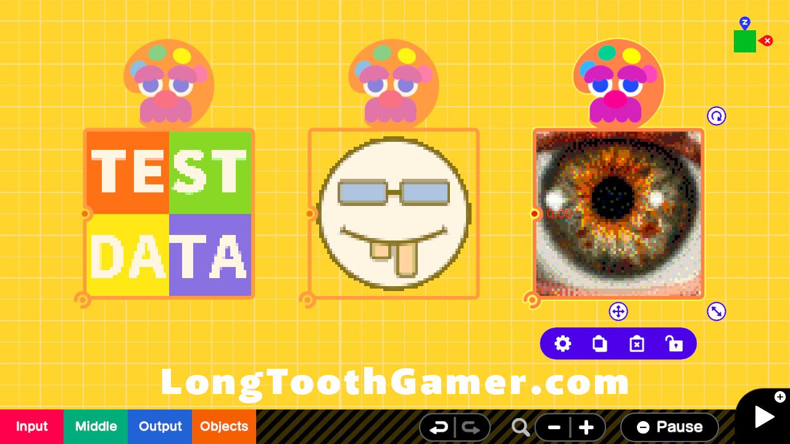
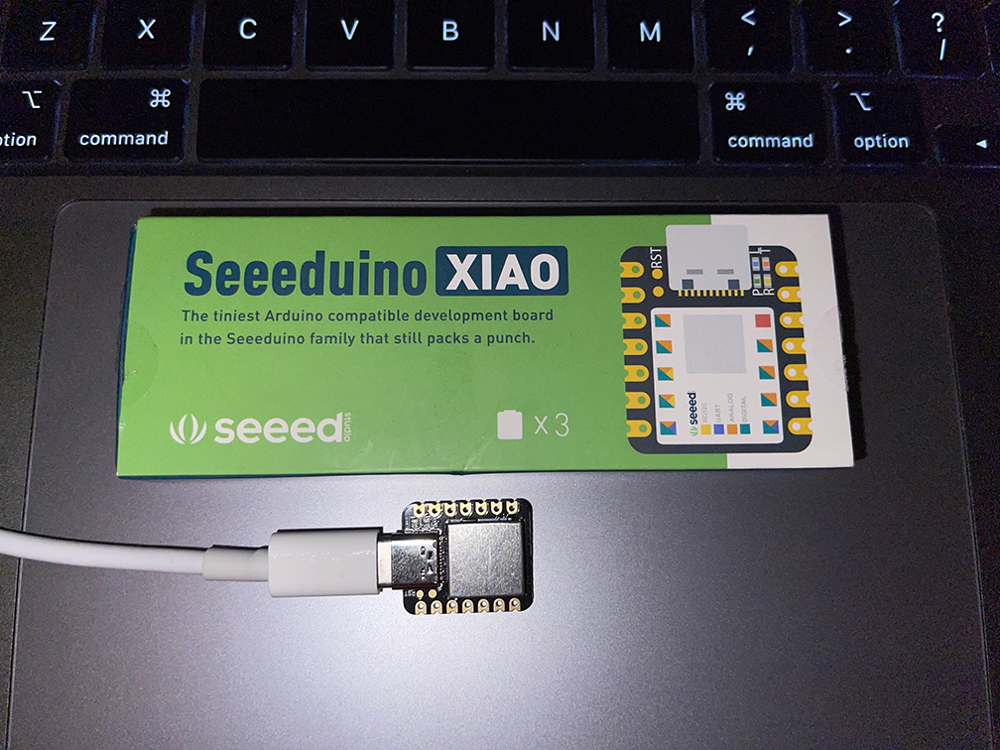
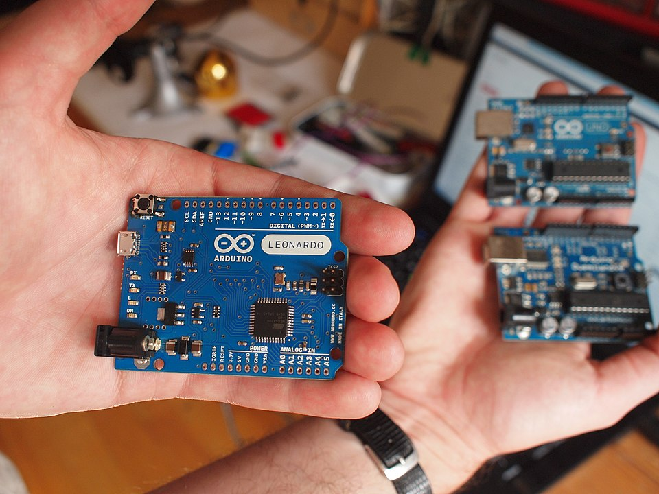

# automatic-gbg-texture-creator

Automatic Game Builder Garage Texture Creator

[Visit the GitHub page instead](https://raycardillo.github.io/automatic-gbg-texture-creator/) if you just want to **get going quickly**. It includes a quick overview, a YouTube video demonstrating the process (and includes product links), and has everything you need to get started quickly all in one place for convenience.

<figure>
  
  <figcaption style="font-style:italic;font-weight:300;">Photo Credit: Ray Cardillo / LongToothGamer</figcaption>
</figure>

-----

_If you want more details about the internals, or if you're a Software Developer, then this README is the best place to start._

-----

## Background
_This is based upon some great work that has been done by **VideoDojo** community members (mainly **Scrubz** and **Borri** to my knowledge). Their solution was originally developed for an **Arduino Leonardo** board._

I had some spare **Seeeduino XIAO** boards sitting around and the original code does not work for TinyUSB based boards. I love the tiny Arduino variants because they're inexpensive and very capable little microprocessors, but they are not "standard" Arduino boards so you have to use special board libraries for them. Also, there aren't as many special purpose utility helper libraries available.

I spent many hours understanding their solution, understanding the limitations of the TinyUSB devices, experimenting, and investigating options. Ultimately, because of various aspects of device compatibility and library availability, I was able to develop a TinyUSB variant of the mouse controller program with a special TinyUSB mouse utility helper class. See my [other research](#other-research) at the bottom of the page if you're interested in other improvements I experimented with.

## Solution Space
The are basically two parts of the solution. First, the image must be converted and pixel texture data extracted. Next, the pixel data is used by the mouse controller to draw a Texture Nodon.

### Image Extraction Utilities
The image extraction utilities convert an image into pixel data that is used by the mouse controller program. It produces a CSV file that is copy and pasted into the mouse controller program.

With permission from **Scrubz**, I have made the latest versions of the two most popular tools in the `utils` directory for convenience. If you want to see the latest they're working on, then connect with them on the [VideoDojo community Discord](https://discord.com/channels/851450528944357437/941124085595910174). The latest versions are in the pinned posts in `Community Texture Tools` under `help-and-tutorials` messages.

#### Pixel Data Format
The extracted data is simply a series of 8-bit (`uint8_t`) values representing colors that are supported in the Texture Nodon editor palette. The first color is the "most common color" and can be used for an initial bucket fill operation or a similar shortcut approach. Texture Nodons are `64` pixels square, so there are `4096` values that follow (`64` rows x `64` columns of pixels) and each represent the pixel color at that location.

| INDEX | 00 | 01      | ... | 64      | ... | N                             |
| ----- | -- | ------- | --- | ------- | --- | ----------------------------- |
| COLOR | BG | (00,00) | ... | (63,00) | ... | ( (N-1) % 64) , (N-1) / 64) ) |

### Mouse Controller Program
The mouse controller program is uploaded to a microprocessor board which is then connected to a Nintendo Switch to simulate mouse movements over the USB port. The program goes through the pixel data and sends mouse movements and clicks to automatically create Texture Nodons. Not only is this faster than manually creating them, but it's more accurate and less frustrating as well.

#### Seeeduino XIAO / TinyUSB
Follow the instructions in the **[agbgtc_tinyusb](./agbgtc_tinyusb)** directory (or watch the YouTube video from the GitHub page link above). In theory, it should work on any TinyUSB device but in practice it currently depends on the `Adafruit_TinyUSB` library (version `0.10.5`). I also had to create a special mouse utility helper specifically for this project. I've currently only tested it on the Seeeduino XIAO board.

<figure>
  
  <figcaption style="font-style:italic;font-weight:300;">Photo Credit: Ray Cardillo / LongToothGamer</figcaption>
</figure>

#### Arduino Leonardo
Visit the [VideoDojo community Discord](https://discord.com/channels/851450528944357437/941124085595910174) and see the pinned posts in `Community Texture Tools` under `help-and-tutorials` for more information about **Borri**'s version.

<figure>
  
  <figcaption style="font-style:italic;font-weight:300;">Photo Credit: Becky Stern - Flickr: Arduino Leonardo</figcaption>
</figure>

-----

## Other Research
While working on this project, I pursued a couple other ideas, but ran out of time and interest in pursuing them further. Capturing some notes here for future reference in case someone else wants to contribute.

### Absolute Mouse Position
I experimented with sending custom HID mouse reports that use absolute mouse positioning instead of a series of delta position updates. I still have the code laying around. The key to this solution is that the mouse reports have to indicate they are ABSOLUTE and not RELATIVE updates. However, as a result of that, it requires (2) 16-bit position parameters instead of (2) 8-bit delta position parameters.

The code actually worked well on my Mac but did not work at all on the Switch. Apparently it is considered non-standard so the Nintendo Switch mouse driver did not recognize the data properly.

### Digitizer HID Devices
I also experimented with sending "digitizer" input instead of "mouse" input by simulating a stylus or touchpad. However, I was unable to get that working and lost interest in pursuing that approach. I think the reason was that most drivers require a fairly robust implementation of several types of input, and I was only trying to implement the bare minimum for this project.

If we can determine what type of devices the Switch supports (and the specific protocol it expects) the speed could be drastically improved by sending direct touch point reports instead of delta mouse movements and clicks (and the extra delay that the drivers require to recognize the location and click reports).

### USB HID Specifications
- https://www.usb.org/sites/default/files/documents/hid1_11.pdf
- https://www.usb.org/sites/default/files/documents/hut1_12v2.pdf
